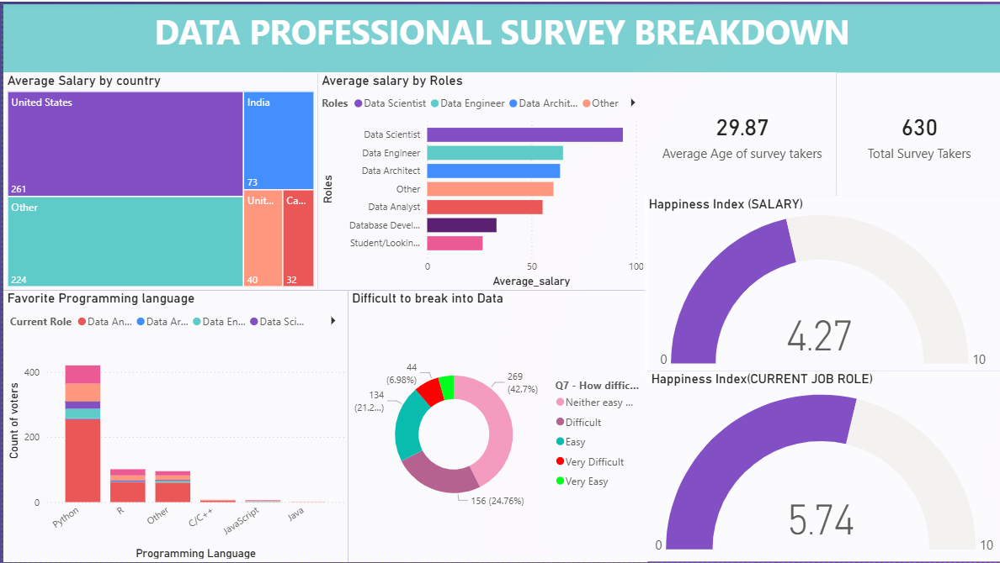

📊 Power BI – Data Professional Survey Analysis

📌 Project Overview

This project presents an interactive Power BI dashboard analyzing survey data from 630+ data professionals.  

The objective was to clean, transform, and model raw survey data to extract meaningful insights about salary trends, job roles, geographic distribution, and satisfaction levels.

🛠 Tools \& Technologies Used
- Power BI Desktop  
- Power Query (Data Cleaning \& Transformation)  
- DAX (Data Analysis Expressions)  
- Data Modeling \& Relationships  
- KPI Cards, Gauges, Bar Charts, Donut Charts  
- Interactive Filters \& Dashboard Design  

🧹 Data Preparation (Power Query)
Before building the dashboard, the dataset was transformed using Power Query:
- Removed duplicate records  
- Handled missing/null values  
- Standardized categorical fields (roles, countries, etc.)  
- Created calculated columns  
- Structured data model for analysis  
- Optimized dataset for performance  

📂 Dataset
- 630+ survey responses  
- Features include:

&nbsp; - Country  
&nbsp; - Job Role  
&nbsp; - Average Salary  
&nbsp; - Programming Language  
&nbsp; - Age  
&nbsp; - Work-Life Balance Satisfaction  
&nbsp; - Salary Satisfaction  
&nbsp; - Difficulty to Break into Data Field  

📊 Dashboard Preview

🔹 Full Dashboard Overview

📈 Key Business Insights
- Salary trends strongly correlate with job role specialization  
- Geographic location impacts compensation significantly  
- Python remains the most preferred programming language  
- Entry difficulty perception highlights competitive industry dynamics  
- Satisfaction metrics provide insight into workforce retention patterns  

🚀 Project Outcome
Transformed raw survey data using Power Query and built an interactive Power BI dashboard leveraging DAX measures and structured data modeling to deliver actionable analytical insights.

